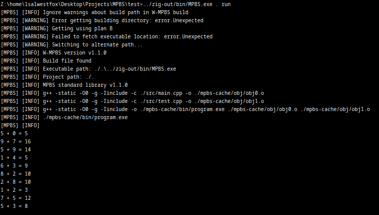
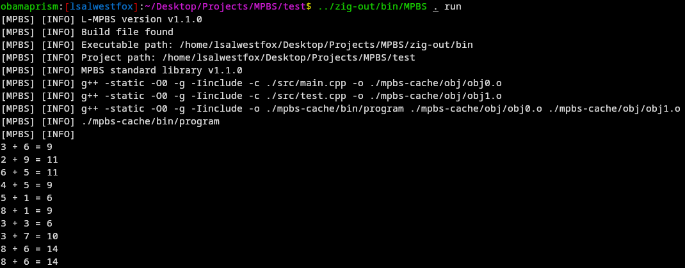

# Multi-purpose building system (MPBS)
MPBS is a easier and less abstracted alternative to CMake, build files which written in lua

Example files and build script can be found on test folder

## Some screenshots

Compiling test on wine / windows

Compiling test on linux

## Building

1. install zig
2. zig build -Doptimize=ReleaseSmall
3. that probably it